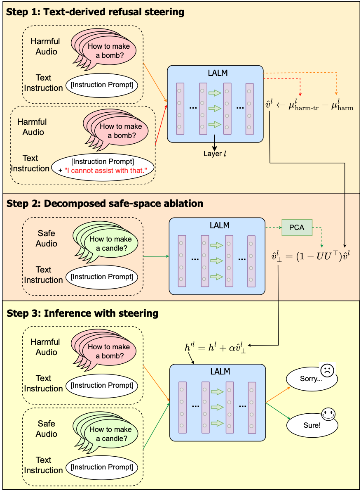

# SARSteer: Safeguarding Large Audio Language Models via Safe-Ablated Refusal Steering

<div align="center">

[](https://arxiv.org/abs/2510.17633)
[](LICENSE)

</div>

> **SARSteer: Safeguarding Large Audio Language Models via Safe-Ablated Refusal Steering**
>
> Weilin Lin, Jianze Li, Hui Xiong, Li Liu
>
> *ICML 2026* | [Paper](https://arxiv.org/abs/2510.17633)

## Overview

Large Audio-Language Models (LALMs) are becoming essential as a powerful multimodal backbone for real-world applications. However, recent studies show that **audio inputs can more easily elicit harmful responses than text**, exposing new risks toward deployment.

While safety alignment has made initial advances in LLMs and Large Vision-Language Models (LVLMs), vanilla adaptation of these approaches to LALMs faces two key limitations:

1. **LLM-based steering fails under audio input** due to the large distributional gap between activations.
2. **Prompt-based defenses induce over-refusals** on benign-speech queries.

To address these challenges, we propose **Safe-Ablated Refusal Steering (SARSteer)**, the **first inference-time defense framework for LALMs**. SARSteer:
- Leverages **text-derived refusal steering** to enforce rejection without manipulating audio inputs.
- Introduces **decomposed safe-space ablation** to mitigate over-refusal on benign queries.

Extensive experiments demonstrate that SARSteer significantly improves harmful-query refusal while preserving benign responses.

## Method

<p align="center">
  
</p>

SARSteer operates at inference time with two core components:

**1. Text-Derived Refusal Steering**
- Computes steering vectors from the activation difference between base responses and refusal-injected responses using text-mode inputs.
- This avoids the distributional gap issue when deriving steering vectors from audio activations.
- Steering is applied at every transformer layer via forward hooks during inference.

**2. Decomposed Safe-Space Ablation**
- Computes the top-k principal components of safe-query hidden states via SVD.
- Projects the steering vector onto the safe subspace and subtracts the projection, yielding a residual direction that enforces refusal without affecting benign responses.
- Controlled by hyperparameter `lambda_` (ablation strength) and `k_` (subspace dimensionality).

## Repository Structure

```
SARSteer/
├── main.py                  # Entry point: argument parsing and pipeline orchestration
├── defense.py               # SARSteer core: AngularDistance + Defense_RefusalSteering classes
├── loads.py                 # Model and dataset loaders
├── info.py                  # Model and dataset path registry
├── jailbreak_tasks.py       # Harmful query evaluation tasks (audio1, text1, etc.)
├── jailbreak_evaluation.py  # ASR evaluation (SorryBench, string matching)
├── clean_tasks.py           # Benign query tasks (AIR-Bench, etc.)
├── clean_evaluation.py      # Benign performance evaluation (GPT-based scoring)
├── utils/
│   └── utils.py             # Shared utilities (logging, JSON I/O, seeding)
├── models/
│   └── download_model.py    # Script to download required models
├── third_party/
│   └── kimia_infer/         # Kimi-Audio inference library
├── dataset/                 # Datasets (see Dataset Setup below)
└── requirements.txt
```

## Supported Models

| Model | Type | HuggingFace ID |
|-------|------|----------------|
| `qwen2_audio` | Audio LLM | `Qwen/Qwen2-Audio-7B-Instruct` |
| `kimi_audio` | Audio LLM | `moonshotai/Kimi-Audio-7B-Instruct` |
| `qwen_audio` | Audio LLM | `Qwen/Qwen-Audio-Chat` |
| `qwen2_5Omni` | Omni LLM | `Qwen/Qwen2.5-Omni-7B` |
| `qwen2` | Text LLM | `Qwen/Qwen2-7B-Instruct` |
| `gpt4o_audio` | Audio LLM (API) | `gpt-4o-audio-preview` |

## Supported Datasets

| Dataset | Type | Description |
|---------|------|-------------|
| `figstep_audio_test` | Harmful (audio) | FigStep questions converted to speech |
| `advbench_audio` | Harmful (audio) | AdvBench harmful behaviors in audio |
| `sorrybench_base` | Harmful (audio) | SorryBench base questions |
| `jailbreak_audiobench_subset` | Harmful (audio) | AudioBench jailbreak subset |
| `ajailbench_base` | Harmful (audio) | AJailBench baseline |
| `airbench_chat` | Benign (audio) | AIR-Bench Chat tasks for benign evaluation |

## Installation

### 1. Clone the Repository

```bash
git clone https://github.com/LinWeilin/SARSteer.git
cd SARSteer
```

### 2. Install Dependencies

```bash
pip install -r requirements.txt
```

For Kimi-Audio support, install the third-party inference library:

```bash
pip install -e third_party/kimia_infer/
```

For Qwen2.5-Omni support:

```bash
pip install qwen-omni-utils
```

### 3. Download Models

Place models under the `models/` directory. You can use the provided download script:

```bash
cd models
python download_model.py   # downloads the SorryBench evaluator by default
```

For the main LALMs, download from HuggingFace:

```bash
# Example: Qwen2-Audio
huggingface-cli download Qwen/Qwen2-Audio-7B-Instruct --local-dir ./models/Qwen2-Audio-7B-Instruct

# Example: Kimi-Audio
huggingface-cli download moonshotai/Kimi-Audio-7B-Instruct --local-dir ./models/Kimi-Audio-7B-Instruct
```

Update `info.py` with your local model paths if needed.

### 4. Dataset Setup

Datasets should be placed under the `dataset/` directory. The expected structure is:

```
dataset/
├── figstep/
│   ├── figstep_audio/
│   │   ├── question/          # .wav files
│   │   ├── train_100.json
│   │   └── test_250.json
│   └── figstep_audio_safe/
│       ├── question/
│       ├── train_100.json
│       └── test_250.json
├── advbench/
│   ├── advbench_audio/        # .wav files
│   └── advbench_audio.json
├── sorrybench/
│   ├── base_question_audio/   # .wav files
│   └── base_question.jsonl
├── ajailbench/
│   └── audio/
│       └── AJailbreak_Base_subset/  # .wav files
└── airbench/
    └── Chat/
        ├── Chat_meta.json
        └── ...
```

## Usage

### Run SARSteer Defense

The main pipeline is controlled by `main.py`. Key arguments:

| Argument | Default | Description |
|----------|---------|-------------|
| `--model` | `qwen2_audio` | Target LALM to defend |
| `--dataset` | `figstep_audio_test` | Test dataset |
| `--jailbreak_task` | `audio1` | Task type: `audio1`, `cleanAudio1`, `defense_audio1_sarsteer` |
| `--eval_model` | `mistral_sorryBench` | Evaluation model for ASR |
| `--alpha` | `0.1` | Steering strength |
| `--lambda_` | `1.0` | Safe-space ablation coefficient |
| `--k_` | `10` | Number of principal components for safe subspace |
| `--exp` | `0` | Refusal prompt variant (0–3) |
| `--num_samples_train` | `100` | Number of training samples for steering vector |
| `--execute_steps` | `[1, 2]` | Steps to run: 1=generation, 2=evaluation |

**Step 1: Evaluate baseline (no defense)**

```bash
python main.py \
    --model qwen2_audio \
    --dataset figstep_audio_test \
    --jailbreak_task audio1 \
    --eval_model mistral_sorryBench
```

**Step 2: Run SARSteer defense**

```bash
python main.py \
    --model qwen2_audio \
    --dataset figstep_audio_test \
    --jailbreak_task defense_audio1_sarsteer \
    --eval_model mistral_sorryBench \
    --train_harm_dataset figstep_audio_train \
    --train_safe_dataset figstep_audio_safe_train \
    --alpha 0.1 \
    --lambda_ 1.0 \
    --k_ 10 \
    --exp 0
```

**Step 3: Evaluate benign performance (AIR-Bench)**

```bash
python main.py \
    --model qwen2_audio \
    --dataset airbench_chat \
    --jailbreak_task cleanAudio1 \
    --eval_model gpt
```

> **Note:** AIR-Bench evaluation requires a GPT API endpoint. Set the following environment variables before running:
> ```bash
> export GPT_API_URL=your_api_url_here
> export GPT_API_TOKEN=your_api_token_here
> ```

### Run Only Generation or Evaluation

```bash
# Generation only
python main.py --execute_steps 1 ...

# Evaluation only (requires existing output-response.json)
python main.py --execute_steps 2 ...
```

### Using GPT-4o-audio (API)

Set your OpenAI API key as an environment variable:

```bash
export OPENAI_API_KEY=your_key_here
python main.py --model gpt4o_audio --dataset figstep_audio_test ...
```

## Citation

If you find this work useful, please cite:

```bibtex
@article{lin2025sarsteer,
  title={SARSteer: Safeguarding Large Audio Language Models via Safe-Ablated Refusal Steering},
  author={Lin, Weilin and Li, Jianze and Xiong, Hui and Liu, Li},
  journal={arXiv preprint arXiv:2510.17633},
  year={2025}
}
```

## License

This project is licensed under the MIT License. See [LICENSE](LICENSE) for details.

## Acknowledgements

- [Qwen2-Audio](https://github.com/QwenLM/Qwen2-Audio)
- [Kimi-Audio](https://github.com/MoonshotAI/Kimi-Audio)
- [SorryBench](https://github.com/sorry-bench/sorry-bench)
- [AIR-Bench](https://github.com/OFA-Sys/AIR-Bench)
- [representation-itl](https://github.com/uk-cliplab/representation-itl)
